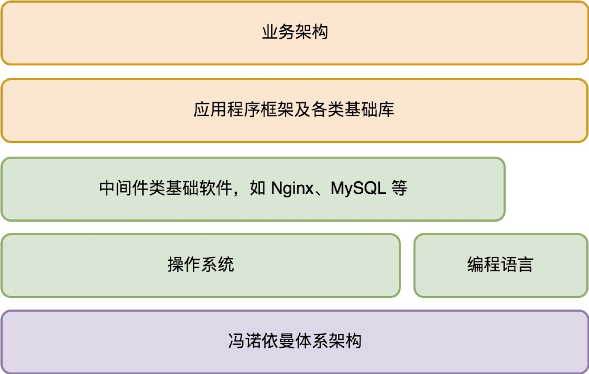
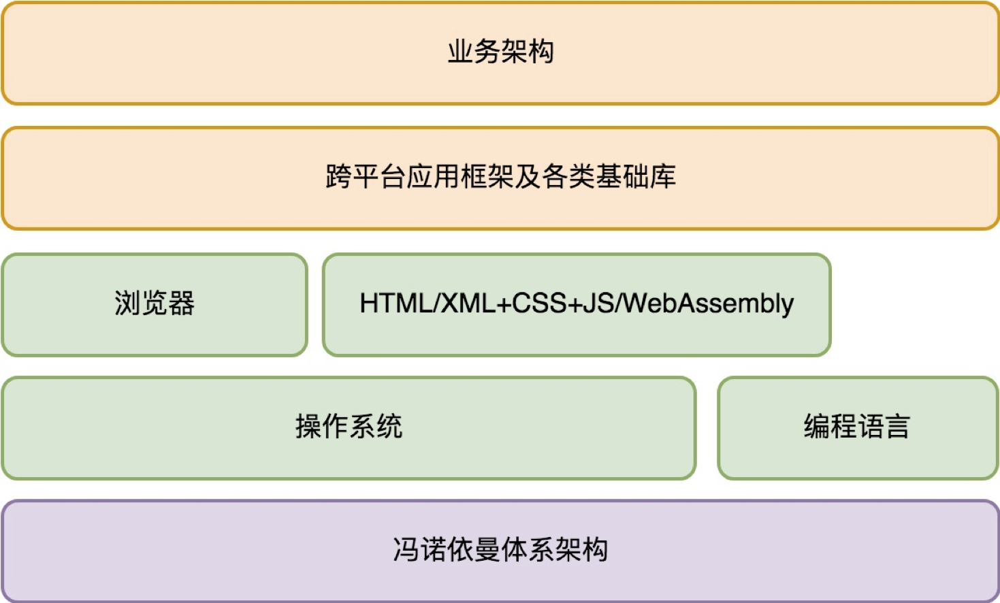

##### 那怎么才能成长为优秀的软件架构师？软件架构师和软件工程师最根本的差别又在哪里？我认为关键在于四个字：掌控全局。
    掌控全局，就是对系统的全貌了然于胸。从传统的建筑工程来说，建筑架构师并不单单要会画建筑图纸，而是要对地基构建、土质、材料、建筑工艺等等所有有可能影响建筑质量的因素都要了然于胸。
    掌控全局，并不是无所不能，不是成为全栈，怎么做到掌控全局？核心在于对知识脉络的体系化梳理。这是架构能力构建和全面提升的关键。这种方法不单单是在软件工程中适用。
    掌控全局的前提是：在自己心中去重新构建出整个世界。在这个过程中，你不需要一上来沉浸在某个技术的实现细节（除非它影响了你对这个世界构建过程的理解），但是你知道整个世界的脉络，知道整个世界的骨架。
#####应用程序的基础架构
    电脑——可以统一看作由“中央处理器 + 存储 + 一系列的输入输出设备“
#####为何电脑能完成这么多复杂而多样化的工作？
    第一是可编程性.中央处理器（CPU）的指令分为如下这几类。
        计算类，也就是支持我们大家都熟知的各类数学运算，如加减乘除、sin/cos 等等。
        I/O 类，（从存储读写数据）从输入输出设备读数据、写数据。
        指令跳转类，在满足特定条件下跳转到新的当前程序执行位置。
    第二是开放设计的外部设备支持。
        它能够做的是从某个编号的设备（通常这个设备编号被称为“端口”）读入一段数据，或者向设备的端口写入一段数据。
    电脑的 CPU 是一个非常简洁的模型，它只读入和写出数据，对数据进行计算。
#####操作系统解决的问题
    它首先要解决的是软件治理的问题。建立安全保护机制，确保你的电脑免受恶意软件侵害。同时，它也要建立软件之间的协作秩序，让大家按照期望的方式进行协作。
    其次解决的是基础编程接口问题。编程接口一方面简化了软件开发，另一方面提供了多软件共存（多任务）的环境，实现了软件治理。
今天的我们开发软件的时候，已经处于一些基础的架构设计之中。像冯·诺依曼计算机体系，像操作系统和编程语言，这些都是我们开发一个应用程序所依赖的基础架构。     

基础架构解决的是与业务无关的一些通用性的问题，这些问题往往无论你具体要做什么样的应用都需要面对。而且，基础架构通常以独立的软件存在，所以也称为基础软件。        

在越强大的基础架构支撑下，应用程序开发需要关注的问题就越收敛，我们的开发效率就越高。在我们只需要关注应用程序本身的业务问题如何构建时，我们说自己是在设计应用程序的业务架构（或者叫“应用架构”）。
##### 服务端应用架构体系

##### 客户端应用架构体系

具备架构思维并不难，而且极有必要。不管今天的你是不是团队里的一位架构师，对任何一位程序员来说，具备架构思维将会成为让你脱颖而出的关键。

#####我们应该如何去分析架构设计中涉及的每一个零部件。换一句话说，当我们设计或分析一个零部件时，我们会关心哪些问题。
    第一个问题，是需求。这个零部件的作用是什么？它能被用来做哪些事情？（某种意义上来说更重要的是）它不会被用来做哪些事情？
    第二个问题，是规格。这个零部件接口是什么样的？它如何与其他零件连接在一起的？
电脑可以被看做由 “中央处理器 + 存储 + 一系列的输入输出设备” 构成。      
#####架构思维上我们学习到什么？
    第一步是需求分析。从需求分析角度来说，关键要抓住需求的稳定点和变化点。需求的稳定点，往往是系统的核心价值点；而需求的变化点，则往往需要相应去做开放性设计。
#####编程范式
    其一是过程式。过程式就是以一条条命令的方式，让计算机按我们的意愿来执行。
    其二是函数式。函数式本质上是过程式编程的一种约束，它最核心的主张就是变量不可变，函数尽可能没有副作用
    其三是面向对象。面向对象在过程式的基础上，引入了对象（类）和对象方法（类成员函数），它主张尽可能把方法（其实就是过程）归纳到合适的对象（类）上，不主张全局函数（过程）。面向对象语言的代表是 Java、C#、C++、Go 等等。

领域的需求理解是需要一个过程的，对客户需求的理解不可能一蹴而就。        
一个优秀的架构师除了需要“在心里对需求反复推敲”的严谨态度外，对客户反馈的尊重之心也至关重要。只有心里装着客户，才能理解好需求，做好架构。       
