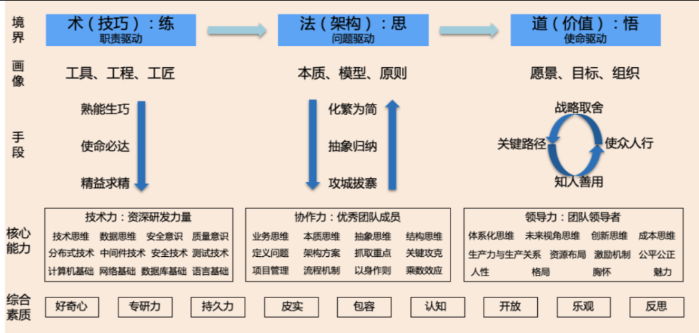
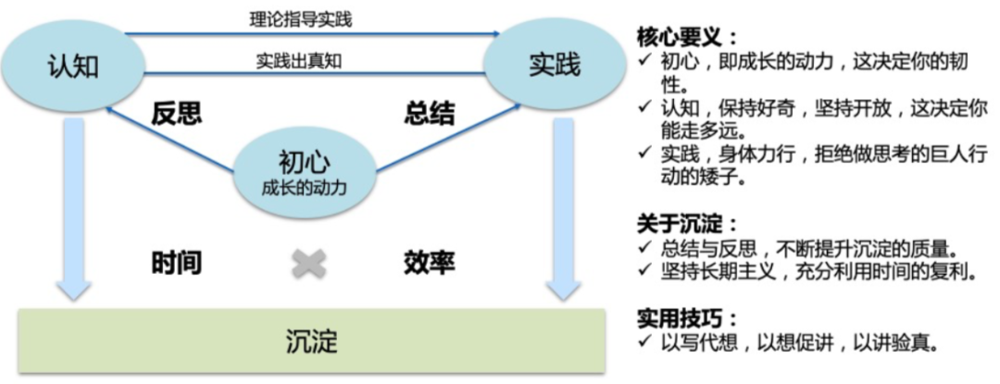

###两类日常工作

#### 重复琐碎类工作
随时都可能有人来问你问题，还有可能是同一个问题不同的人来问你很多遍。这类工作称归纳为重复/琐碎类工作。 

    1、就事论事，把这个问题回答了结束。到这个程度你只是解决了一个具体的问题。很可惜我们很多技术同学都是处于这个层次。  
    2、解答完这个问题后即整理成文档，把排查步骤写清楚，提升自己和同组人的工作效率。到这个程度说明你看到并解决了内部效率问题。  
    3、将此排查问题的方法和逻辑固化为小工具给到咨询的同学去用，让他以后可以自助排查解决，这样既解决了别人的问题也彻底释放了自己和同组人的效能。到这个程度说明你重新定义了效能问题并找到更好提效的办法。  
    4、将此问题背后根因找到，从业务原理或者产品功能上去找解法。将技术工具抽象为业务功能的完善。到这个程度说明你已经从单纯的技术提效看到了架构合理性问题，并尝试在业务上寻求彻底根治的办法。  

#### 抽象复杂类工作
典型特质就是需要只能感受到现象，很难找到根因，没有明确目标和固定解法，需要自己做方案定策略。

    1、找到抱怨的同学，问一问具体的问题是什么，然后针对性解决。
    2、更加广泛收集问题，然后列出来表格，归类分析并安排负责人跟进解决，最后定期跟踪进度。
    3、深入分析表格的中的问题并对问题进行抽象，从架构调优和产品功能的角度去寻找原因，并寻找解决这些问题带来的业务价值，并确定目标拆解路径，最后按照任务推进和跟踪进展。
    4、从更全局角度去思考此目标与年度目标的关系，与组织发展的关系，思考如何扩大此事的效益，思考如何通过这些事的解决锻炼和培养团队同学。

###技术能力层次模型
有技术能力的做法特征是能够通过现象看到本质，并能够通过对问题的抽象归纳进行技术架构层调优以解决同类问题。  
技术能力是一种以解决某种问题为目标的思路、方法与执行手段，其本质就是解决问题的能力。在编程领域，就是对遇到的业务问题进行抽象、提炼以及逻辑的构建，通过研发工具以提升解决问题的效能，减低人工低效的重复工作。

###如何提升技术能力
